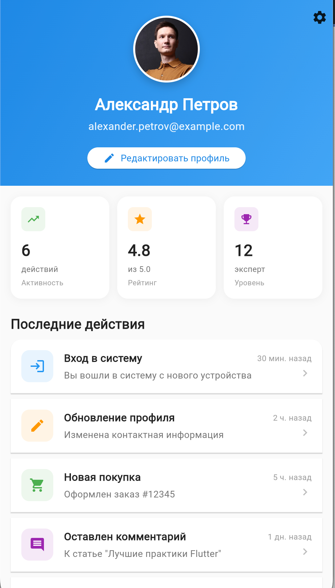

# Womanly Demo

Демонстрационный Flutter проект с использованием BLoC паттерна и Freezed для управления состоянием.

## Описание

Приложение представляет собой экран профиля пользователя с следующими возможностями:

- 📱 Отображение профиля пользователя с аватаром
- ✏️ Редактирование данных профиля (имя, email)
- 🖼️ Управление аватаром
- 📊 Статистика активности пользователя
- 📜 История последних действий
- 🔄 Pull-to-refresh для обновления данных
- ⚙️ Меню настроек

## Скриншот

<p align="center">
  
</p>

## Технологический стек

- **Flutter** - UI фреймворк
- **BLoC** (^8.1.4) - управление состоянием
- **flutter_bloc** (^8.1.6) - Flutter интеграция для BLoC
- **Freezed** (^2.5.7) - кодогенерация иммутабельных классов
- **json_serializable** (^6.8.0) - сериализация JSON
- **build_runner** (^2.4.12) - инструмент для кодогенерации

## Архитектура

Проект использует BLoC паттерн для разделения бизнес-логики и UI:

```
lib/
├── main.dart              # Точка входа и UI компоненты
└── main.freezed.dart      # Сгенерированные Freezed классы
```

### Основные компоненты:

- **Models**: `UserProfile`, `UserActivity` - модели данных с использованием Freezed
- **Events**: `ProfileEvent` - события профиля (load, refresh, edit, update, etc.)
- **States**: `ProfileState` - состояния профиля (initial, loading, loaded, error, updating)
- **BLoC**: `ProfileBloc` - бизнес-логика управления профилем
- **UI**: `UserProfileScreen`, `ProfileView` - пользовательский интерфейс

## Начало работы

### Предварительные требования

- Flutter SDK (версия 3.9.2 или выше)
- Dart SDK

### Установка

1. Клонируйте репозиторий:
```bash
git clone https://github.com/n0n1/womanly_demo.git
cd womanly_demo
```

2. Установите зависимости:
```bash
flutter pub get
```

3. Генерация кода (если необходимо):
```bash
flutter pub run build_runner build --delete-conflicting-outputs
```

4. Запустите приложение:
```bash
flutter run
```

## Особенности реализации

### Freezed модели

Все модели данных используют Freezed для:
- Иммутабельности
- Генерации `copyWith` методов
- Паттерна union types для Events и States
- Поддержки `when` и `map` методов

### BLoC паттерн

Состояние приложения управляется через BLoC:
- **Events** описывают намерения пользователя
- **States** представляют текущее состояние UI
- **BLoC** обрабатывает события и эмитит новые состояния

### UI компоненты

- `SliverAppBar` с градиентом и аватаром
- Карточки статистики (активность, рейтинг, уровень)
- Список последних действий с анимациями
- Диалог редактирования профиля
- Меню настроек

## Структура данных

### UserProfile
- `id` - уникальный идентификатор
- `name` - имя пользователя
- `email` - электронная почта
- `avatarUrl` - путь к аватару (поддерживает как URL, так и локальные assets)
- `recentActivities` - список последних действий

### UserActivity
- `id` - идентификатор действия
- `title` - заголовок
- `description` - описание
- `timestamp` - время действия
- `type` - тип действия (login, update, purchase, comment, like, share)

## Лицензия

Этот проект создан в демонстрационных целях.

## Автор

[Telenkov Ivan](https://github.com/n0n1)
